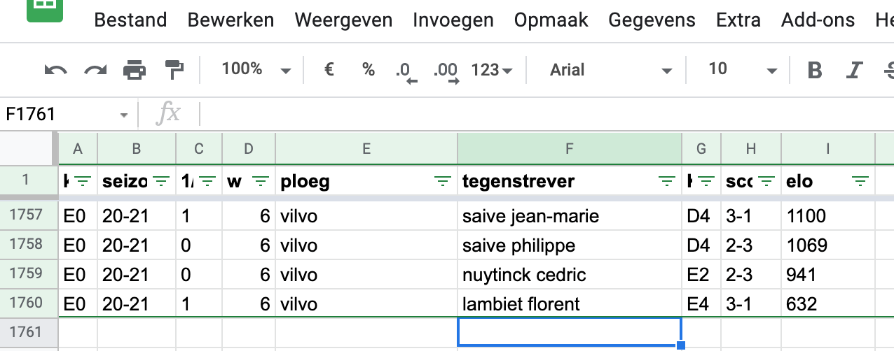
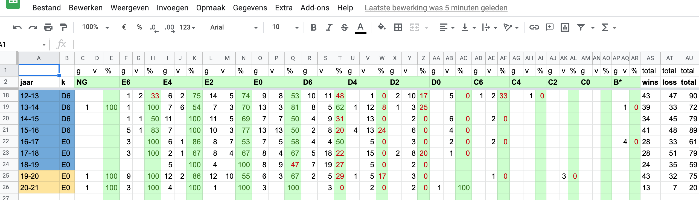
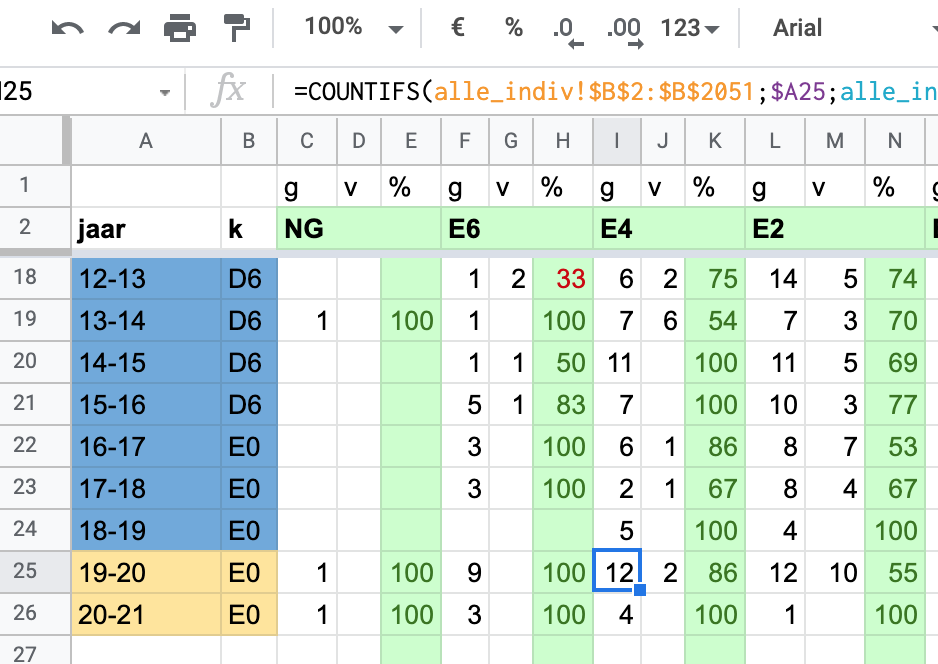
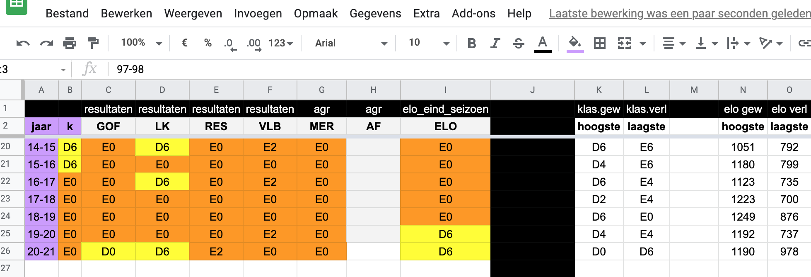
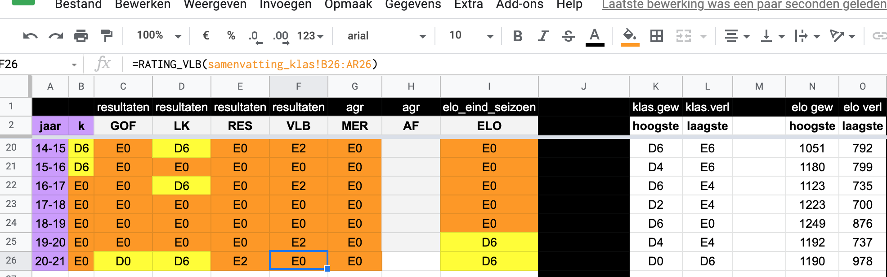
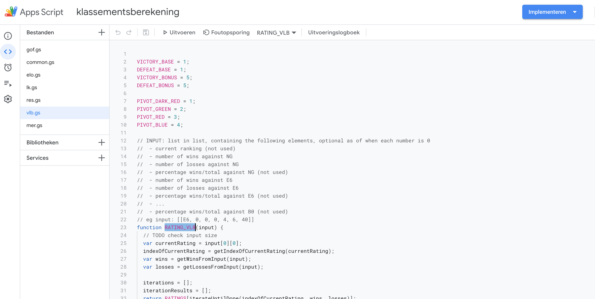

# GEBRUIK IN GOOGLE DRIVE SPREADSHEETS

Een voorbeeld van gebruik in Google Drive spreadsheets:

## 1. Overzicht individuele resultaten

Als basis, hou ik al mijn individuele resultaten bij in een sheet, sheet 1.

Zie screenshot, een lijst van 1700 individuele uitslagen

## 2. Overzicht per seizoen en per klassement van de tegenstander

Verloren en gewonnen wedstrijden per klassement geaggregeerd, in sheet 2.

Deze data wordt gegenereerd op basis van de resultaten in sheet 1 door COUNTIF functie.

## 3. Klassementsbepaling voor alle geimplementeerde algoritmes

Sheet 3 bevat de klassementsbepalingen per algoritme, per seizoen

Per algoritme, worden de rijen (seizoenen) in sheet 2 als input gegeven voor de klassementsbepaling via dat algoritme aan de javascript functie die gedefinieerd is.
Bvb voor VLB algoritme, is dit de functie RATING_VLB()

## 4. Definitie van de functies

De javascript functies moeten uiteraard beschikbaar zijn. Dit kan in Google Apps Script.
In een Google spreadsheet, via het menu 'extra' - 'Scripteditor'

Hier kunnen de javascript files opgeslagen worden.
De imports (eerste lijn in de file) en module exports (laatste lijn in de file) moeten wel verwijderd worden.

Voorbeeld voor vlb, de RATING_VLB functie:

